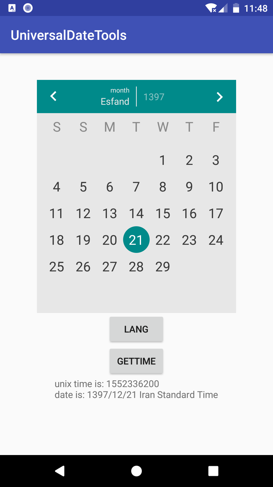
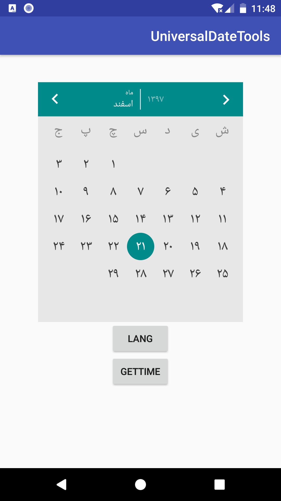
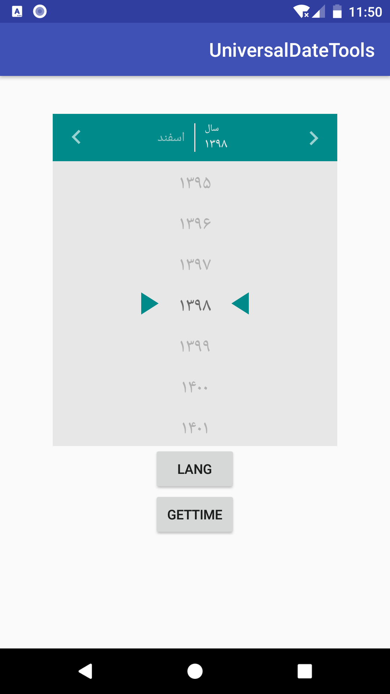

# Android multi calender tools library for android
android date tools and <b>date picker</b> for tree calendar systems <b>Jalali , Hijri , Gregorian</b>

# Screen shots
primary color will be your theme color

    
    
    
  

# Add to your project
copy [this](https://github.com/hooshkar/AndroidMultiCalenderTools/releases/download/1.5.0/uneversaldatetools-release.aar) to "yourProject/app/libs"   [have problem?](https://github.com/hooshkar/AndroidMultiCalenderTools/wiki/install)

# How to use
<b>date converter:</b> more
[here](https://github.com/hooshkar/AndroidMultiCalenderTools/wiki/Convert).
~~~java
DateModel hijri = DateConverter.GregorianToHijri(2018, 1, 1);
//hijri.day;
//hijri.month;
//hijri.year;
~~~

<b>date picker:</b>  
xml:(don't change height and width)
~~~xml
<com.ali.uneversaldatetools.datePicker.UDatePicker
        android:id="@+id/date_picker"
        android:layout_width="300dp"
        android:layout_height="350dp"/>
~~~
java:
~~~java
UDatePicker uDatePicker = findViewById(R.id.date_picker);

//push date to show in first time
uDatePicker.ShowDatePicker(dateSystem);

//or use current date
uDatePicker.ShowDatePicker(Calendar.Jalali);

//get on day selected event
uDatePicker.setOnDateSelected((dateSystem, unixTime) -> {
    //do something...
});

//or get date when ever you want
uDatePicker.getSelectedUnixTime();//as a unix time
uDatePicker.getSelectedDate();//as a DateSystem object

~~~

# Supported language:
1.persian  
2.english  
and its easy to add new language see
[here](https://github.com/hooshkar/AndroidMultiCalenderTools/wiki/language).

# LICENCE
under [MIT](https://github.com/hooshkar/AndroidMultiCalenderTools/blob/master/LICENSE) licence
